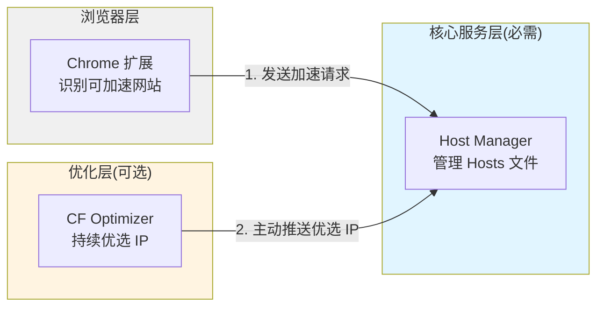
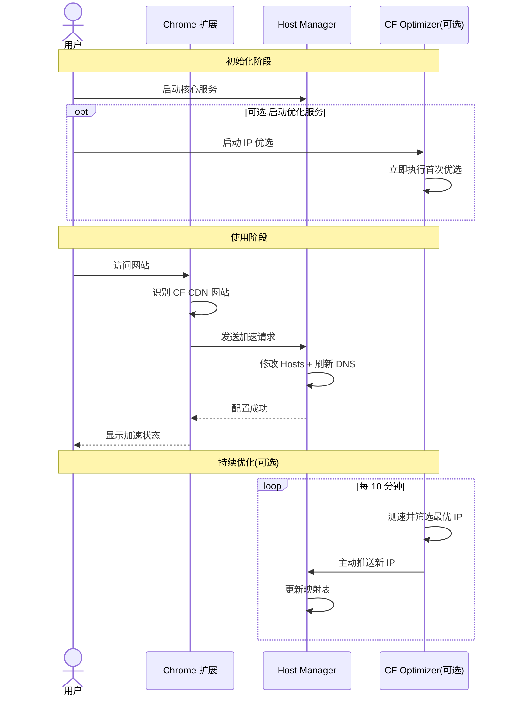

<div align="center">

# 🚀 HostBoost
[![Contributors][contributors-shield]][contributors-url]
[![Forks][forks-shield]][forks-url]
[![Stargazers][stars-shield]][stars-url]
[![Issues][issues-shield]][issues-url]
[![MIT License][license-shield]][license-url]

通过 CDN IP 优选和智能 Hosts 管理,显著提升网站访问速度


</div>

---

## 📖 项目简介

HostBoost 通过智能优选 CDN(如 Cloudflare)的 IP 地址并动态修改系统 Hosts 文件,实现对特定网站的访问加速。系统采用模块化设计,由三个核心组件协同工作:

- 🔌 **Chrome 扩展** - 智能识别可加速网站,用户友好的操作界面
- 🛠️ **Host Manager** - 安全管理系统 Hosts 文件和 DNS 缓存
- ⚡ **CF Optimization** - 基于CloudflareSpeedTest, 持续优选 Cloudflare IP

## ✨ 核心特性

- ✅ **自动识别** - 智能检测使用 Cloudflare CDN 的网站
- ✅ **透明加速** - 无感知提速,不改变用户使用习惯
- ✅ **实时优化** - 定时优选最佳 IP
- ✅ **跨平台支持** - 支持 Windows、macOS、Linux


## 🚀 快速开始

### 前置要求

- Chrome/Edge 浏览器(版本 90+)
- 管理员权限(用于修改 Hosts 文件)

### 使用说明

1. 访问 [Release](https://github.com/Rain-kl/HostBoost/releases) 下载最新编译包： 
    ```
    chrome-extension.zip
    # 根据系统以及处理器架构选择对应二进制文件
    cf_optimization-xxx
    host_manager-xxx
    ```
2. 安装chrome拓展
   - 解压 `chrome-extension.zip`
   - 打开 Chromium 浏览器，在地址栏输入 `chrome://extensions/`，然后按回车键。
   - 在右上角，找到并打开“开发者模式”开关。
   - 点击“加载已解压的扩展程序”按钮。
   - 在弹出的文件选择对话框中，找到并选择您解压好的扩展程序文件夹，然后点击“选择文件夹”。

3. 以管理员的身份运行 `host_manager` 

4. 运行 `cf_optimization` 等待优选完成

5. 【可选】关闭 `cf_optimization`


### 开发调试

```bash
git clone https://github.com/Rain-kl/HostBoost.git
cd HostBoost
```
1. 编译浏览器拓展
```bash
cd chrome_extention
pnpm i
pnpm build
```
本地生成 build 文件夹后, 在 chrome 拓展管理界面, 加载未打包的拓展程序

2. 运行 Host Manager

```bash
cd host_manager
go mod tidy
sudo go run main.go
```

3. 运行 Cloudflare 优选器

```bash
cd cloudfla_optimization
go mod tidy
go run main.go
```

### 使用方法

1. 启动所有服务后,进入需要提速的网站在拓展里开启加速
2. 刷新浏览器dns缓存


## 🏗️ 系统架构



**架构特点**:

- Host Manager 是核心服务,可独立运行
- CF Optimizer 主动推送最优 IP
- Chrome 扩展提供用户交互界面


## 📦 项目结构

```
HostBoost/
├── chrome_extention/      # Chrome 浏览器扩展
├── host_manager/          # Hosts 文件管理服务
├── cloudflare_optimization/ # Cloudflare IP 优选服务
└── README.md              # 项目说明
```

## 🔧 工作原理



**核心流程**:
1. **识别**: Chrome 扩展检测 Cloudflare CDN 网站
2. **请求**: 发送加速请求到 Host Manager
3. **配置**: 修改 Hosts 文件并刷新 DNS 缓存
4. **优化**: CF Optimizer 主动推送最优 IP

## 🛣️ 路线图

### 当前版本 (v1.0)

- [x] 基础架构设计
- [x] 项目白皮书
- [x] Chrome 扩展开发
- [x] Host Manager 核心功能
- [x] CloudflareSpeedTest 改造
- [x] action 发布

### 下个版本 (v1.x)
- [x] 刷新浏览器dns缓存
- [x] cdn检测
- [x] 优化使用
- [ ] 跨域安全性防护

### 未来版本 (v2.x)

- [ ] 支持 microsoft 加速
- [ ] 支持 github 加速
- [ ] 支持自定义与规则集
- [ ] mgr升级为交互式cli或图形化界面
- [ ] firefox支持

## 常见问题

### Q1: 为什么需要管理员权限?

A: 修改系统 Hosts 文件和刷新 DNS 缓存需要管理员权限。

### Q2: 会影响其他网站访问吗?

A: 不会。仅对配置的域名生效,不影响其他网站。

### Q3: 如何关闭加速?

A: 删除host增加的内容或者删除 `hosts.json` 的内容然后重启MGR。

### Q4: 支持哪些网站?

A: 目前支持使用 Cloudflare CDN 的网站,未来将支持更多。

---

## 🤝 贡献

项目使用 `monorepo` 策略，不同模块在不同的 git 分支上开发, 贡献时请向对应的分支提交代码


## 📄 许可证

本项目采用 GPL-3.0 许可证。详见 [LICENSE](LICENSE) 文件。

---

<div align="center">

**如果这个项目对你有帮助,请给个 ⭐️ Star 吧!**

</div>


<!-- MARKDOWN LINKS & IMAGES -->
[contributors-shield]: https://img.shields.io/github/contributors/Rain-kl/HostBoost.svg?style=flat-square
[contributors-url]: https://github.com/Rain-kl/HostBoost/graphs/contributors
[forks-shield]: https://img.shields.io/github/forks/Rain-kl/HostBoost.svg?style=flat-square
[forks-url]: https://github.com/Rain-kl/HostBoost/network/members
[stars-shield]: https://img.shields.io/github/stars/Rain-kl/HostBoost.svg?style=flat-square
[stars-url]: https://github.com/Rain-kl/HostBoost/stargazers
[issues-shield]: https://img.shields.io/github/issues/Rain-kl/HostBoost.svg?style=flat-square
[issues-url]: https://github.com/Rain-kl/HostBoost/issues
[license-shield]: https://img.shields.io/github/license/Rain-kl/HostBoost.svg?style=flat-square
[license-url]: https://github.com/Rain-kl/HostBoost/blob/master/LICENSE.txt
