<div align="center">

# 🚀 HostBoost
[![Contributors][contributors-shield]][contributors-url]
[![Forks][forks-shield]][forks-url]
[![Stargazers][stars-shield]][stars-url]
[![Issues][issues-shield]][issues-url]
[![MIT License][license-shield]][license-url]

通过 CDN IP 优选和智能 Hosts 管理,显著提升网站访问速度


</div>

---

## 📖 项目简介

HostBoost 通过智能优选 CDN(如 Cloudflare)的 IP 地址并动态修改系统 Hosts 文件,实现对特定网站的访问加速。系统采用模块化设计,由三个核心组件协同工作:

- 🔌 **Chrome 扩展** - 智能识别可加速网站,用户友好的操作界面
- 🛠️ **Host Manager** - 安全管理系统 Hosts 文件和 DNS 缓存
- ⚡ **CF Optimization** - 基于CloudflareSpeedTest, 持续优选 Cloudflare IP

## ✨ 核心特性

- ✅ **自动识别** - 智能检测使用 Cloudflare CDN 的网站
- ✅ **透明加速** - 无感知提速,不改变用户使用习惯
- ✅ **实时优化** - 每 10 分钟自动优选最佳 IP
- ✅ **跨平台支持** - 支持 Windows、macOS、Linux
- ✅ **安全可靠** - 本地化处理,保护用户隐私
- ✅ **开源免费** - MIT 协议,完全开源

## 🏗️ 系统架构

```mermaid
flowchart LR
    subgraph Browser["浏览器层"]
        Ext["Chrome 扩展<br/>识别可加速网站"]
    end
    
    subgraph Core["核心服务层(必需)"]
        HostMgr["Host Manager<br/>管理 Hosts 文件"]
    end
    
    subgraph Optional["优化层(可选)"]
        CFOpt["CF Optimizer<br/>持续优选 IP"]
    end
    
    Ext -->|"1. 发送加速请求"| HostMgr
    CFOpt -->|"2. 主动推送优选 IP"| HostMgr
    
    style Core fill:#e1f5ff
    style Optional fill:#fff4e1
    style Browser fill:#f0f0f0
```

```mermaid
flowchart TB
    subgraph Browser["用户浏览器"]
        Extension["Chrome 扩展<br/>(智能识别加速域名)"]
    end
    
    subgraph HostMgr["Host Manager Service<br/>(核心服务 - 必需)"]
        API["API 接口"]
        HostFile["Hosts 文件管理"]
        DNS["DNS 缓存刷新"]
        Mapping["域名-IP 映射表"]
    end
    
    subgraph CFOpt["CF Optimization Service<br/>(IP 优选 - 可选)"]
        Timer["定时器<br/>(每10分钟)"]
        Tester["IP 测速引擎"]
        Selector["最优 IP 筛选"]
        Reporter["IP 上报"]
    end
    
    Extension -->|"1. 发送加速请求<br/>(HTTP/WebSocket)"| API
    API --> HostFile
    API --> DNS
    API --> Mapping
    
    Timer --> Tester
    Tester --> Selector
    Selector --> Reporter
    Reporter -->|"2. 主动推送优选 IP<br/>(HTTP API)"| API
    
    style HostMgr fill:#e1f5ff
    style CFOpt fill:#fff4e1
    style Browser fill:#f0f0f0
```





**架构特点**:

- Host Manager 是核心服务,可独立运行
- CF Optimizer 是可选服务,主动推送最优 IP
- Chrome 扩展提供用户交互界面

## 🚀 快速开始

### 前置要求

- Chrome/Edge 浏览器(版本 90+)
- 管理员权限(用于修改 Hosts 文件)

### 开发运行

```bash
git clone https://github.com/Rain-kl/HostBoost.git
cd HostBoost
```
1. 编译浏览器拓展
```bash
cd chrome_extention
pnpm i
pnpm build
```
本地生成 build 文件夹后, 在 chrome 拓展管理界面, 加载未打包的拓展程序

2. 运行 Host Manager

```bash
cd host_manager
go mod tidy
go run main.go
```

3. 运行 Cloudflare 优选器

```bash
cd cloudfla_optimization
go mod tidy
go run main.go
```

### 使用方法

1. 启动所有服务后,Chrome 扩展图标会变为可用状态
2. 访问任何网站,扩展会自动检测是否可以加速
3. 系统会自动优化并保持最佳性能

## 📦 项目结构

```
HostBoost/
├── chrome_extention/      # Chrome 浏览器扩展
├── host_manager/          # Hosts 文件管理服务
├── cloudflare_optimization/ # Cloudflare IP 优选服务
└── README.md              # 项目说明
```

## 🔧 工作原理

```mermaid
sequenceDiagram
    actor User as 用户
    participant Ext as Chrome 扩展
    participant HostMgr as Host Manager
    participant CFOpt as CF Optimizer(可选)
    
    Note over User,CFOpt: 初始化阶段
    User->>HostMgr: 启动核心服务
    opt 可选:启动优化服务
        User->>CFOpt: 启动 IP 优选
        CFOpt->>CFOpt: 立即执行首次优选
    end
    
    Note over User,CFOpt: 使用阶段
    User->>Ext: 访问网站
    Ext->>Ext: 识别 CF CDN 网站
    Ext->>HostMgr: 发送加速请求
    HostMgr->>HostMgr: 修改 Hosts + 刷新 DNS
    HostMgr-->>Ext: 配置成功
    Ext-->>User: 显示加速状态
    
    Note over User,CFOpt: 持续优化(可选)
    loop 每 10 分钟
        CFOpt->>CFOpt: 测速并筛选最优 IP
        CFOpt->>HostMgr: 主动推送新 IP
        HostMgr->>HostMgr: 更新映射表
    end
```



**核心流程**:
1. **识别**: Chrome 扩展检测 Cloudflare CDN 网站
2. **请求**: 发送加速请求到 Host Manager
3. **配置**: 修改 Hosts 文件并刷新 DNS 缓存
4. **优化(可选)**: CF Optimizer 主动推送最优 IP

## 🛣️ 路线图

### 当前版本 (v1.0)

- [x] 基础架构设计
- [x] 项目白皮书
- [x] Chrome 扩展开发
- [x] Host Manager 核心功能
- [x] CloudflareSpeedTest 改造

### 下个版本 (v1.x)

- [ ] 安全防护
- [ ] action 发布
- [ ] cdn检测
- [ ] 优化使用

### 未来版本 (v2.x)

- [ ] 支持更多 CDN 提供商
- [ ] 图形化配置界面
- [ ] 性能监控面板
- [ ] firefox支持

## 常见问题

### Q1: 为什么需要管理员权限?

A: 修改系统 Hosts 文件和刷新 DNS 缓存需要管理员权限。

### Q2: 会影响其他网站访问吗?

A: 不会。仅对配置的域名生效,不影响其他网站。

### Q3: 如何关闭加速?

A: 在 Chrome 扩展中点击禁用,或停止 Host Manager 服务。

### Q4: 支持哪些网站?

A: 目前支持使用 Cloudflare CDN 的网站,未来将支持更多 CDN。

---

## 🤝 贡献

欢迎贡献代码、报告问题或提出建议!

不同模块在不同的 git 分支上开发, 贡献时请向对应的分支提交代码


## 📄 许可证

本项目采用 GPL-3.0 许可证。详见 [LICENSE](LICENSE) 文件。

---

<div align="center">

**如果这个项目对你有帮助,请给个 ⭐️ Star 吧!**

</div>


<!-- MARKDOWN LINKS & IMAGES -->
[contributors-shield]: https://img.shields.io/github/contributors/Rain-kl/HostBoost.svg?style=flat-square
[contributors-url]: https://github.com/Rain-kl/HostBoost/graphs/contributors
[forks-shield]: https://img.shields.io/github/forks/Rain-kl/HostBoost.svg?style=flat-square
[forks-url]: https://github.com/Rain-kl/HostBoost/network/members
[stars-shield]: https://img.shields.io/github/stars/Rain-kl/HostBoost.svg?style=flat-square
[stars-url]: https://github.com/Rain-kl/HostBoost/stargazers
[issues-shield]: https://img.shields.io/github/issues/Rain-kl/HostBoost.svg?style=flat-square
[issues-url]: https://github.com/Rain-kl/HostBoost/issues
[license-shield]: https://img.shields.io/github/license/Rain-kl/HostBoost.svg?style=flat-square
[license-url]: https://github.com/Rain-kl/HostBoost/blob/master/LICENSE.txt