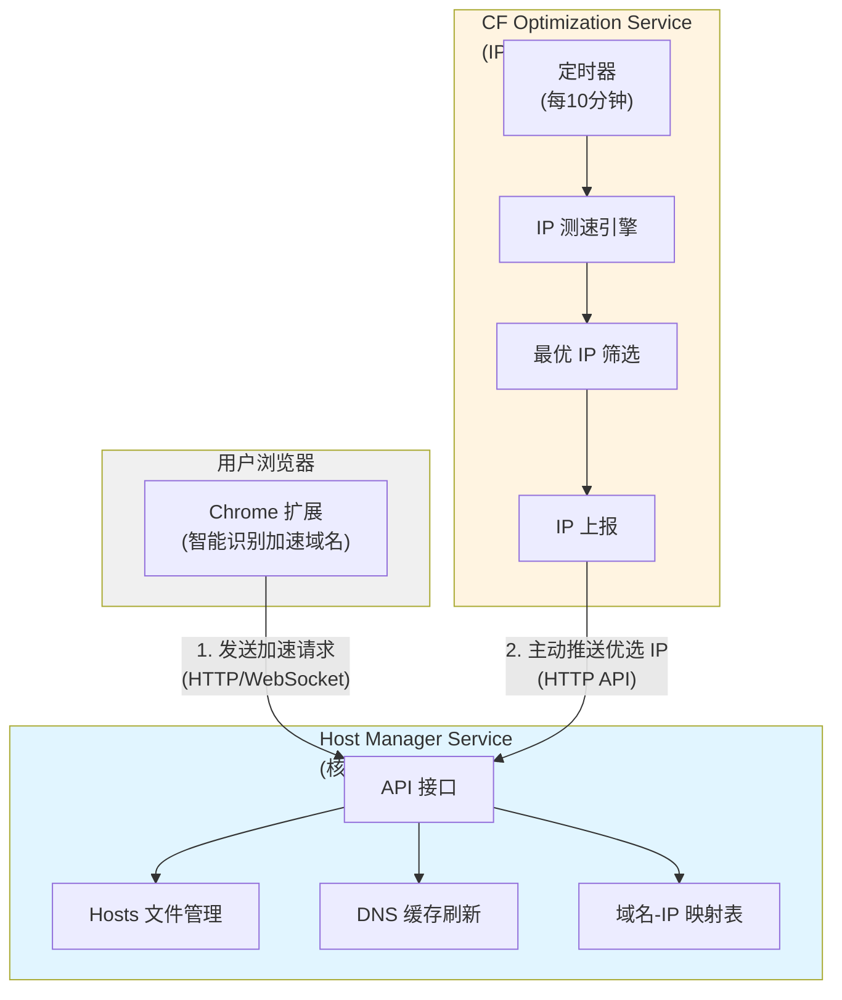

<div align="center">

# 🚀 HostBoost

通过 CDN IP 优选和智能 Hosts 管理,显著提升网站访问速度


</div>

---

## 📖 项目简介

HostBoost 通过智能优选 CDN(如 Cloudflare)的 IP 地址并动态修改系统 Hosts 文件,实现对特定网站的访问加速。系统采用模块化设计,由三个核心组件协同工作:

- 🔌 **Chrome 扩展** - 智能识别可加速网站,用户友好的操作界面
- 🛠️ **Host Manager** - 安全管理系统 Hosts 文件和 DNS 缓存
- ⚡ **CF Optimization** - 基于CloudflareSpeedTest, 持续优选 Cloudflare IP

## ✨ 核心特性

- ✅ **自动识别** - 智能检测使用 Cloudflare CDN 的网站
- ✅ **透明加速** - 无感知提速,不改变用户使用习惯
- ✅ **实时优化** - 每 10 分钟自动优选最佳 IP
- ✅ **跨平台支持** - 支持 Windows、macOS、Linux
- ✅ **安全可靠** - 本地化处理,保护用户隐私
- ✅ **开源免费** - MIT 协议,完全开源

## 🏗️ 系统架构




**架构特点**:

- Host Manager 是核心服务,可独立运行
- CF Optimizer 是可选服务,主动推送最优 IP
- Chrome 扩展提供用户交互界面

## 🚀 快速开始

### 前置要求

- Chrome/Edge 浏览器(版本 90+)
- 管理员权限(用于修改 Hosts 文件)

### 使用方法

1. 启动所有服务后,Chrome 扩展图标会变为可用状态
2. 访问任何网站,扩展会自动检测是否可以加速
3. 系统会自动优化并保持最佳性能

## 📦 项目结构

```
HostBoost/
├── chrome_extention/      # Chrome 浏览器扩展
├── host_manager/          # Hosts 文件管理服务
├── cloudflare_optimization/ # Cloudflare IP 优选服务
└── README.md              # 项目说明
```

## 🔧 工作原理


**核心流程**:
1. **识别**: Chrome 扩展检测 Cloudflare CDN 网站
2. **请求**: 发送加速请求到 Host Manager
3. **配置**: 修改 Hosts 文件并刷新 DNS 缓存
4. **优化(可选)**: CF Optimizer 主动推送最优 IP

## 📊 性能指标

- **加速效果**: 平均提速 30%-70%
- **优选频率**: 每 10 分钟自动优选
- **响应时间**: 配置生效 < 2 秒
- **资源占用**: 内存 < 50MB,CPU < 5%

## 🛣️ 路线图

### 当前版本 (v1.0)

- [x] 基础架构设计
- [x] 项目白皮书
- [ ] Chrome 扩展开发
- [ ] Host Manager 核心功能
- [ ] CloudflareSpeedTest 改造

### 未来计划

- [ ] 支持更多 CDN 提供商
- [ ] 图形化配置界面
- [ ] 性能监控面板
- [ ] 多浏览器支持

## 常见问题

### Q1: 为什么需要管理员权限?

A: 修改系统 Hosts 文件和刷新 DNS 缓存需要管理员权限。

### Q2: 会影响其他网站访问吗?

A: 不会。仅对配置的域名生效,不影响其他网站。

### Q3: 如何关闭加速?

A: 在 Chrome 扩展中点击禁用,或停止 Host Manager 服务。

### Q4: 支持哪些网站?

A: 目前支持使用 Cloudflare CDN 的网站,未来将支持更多 CDN。

---

## 🤝 贡献

欢迎贡献代码、报告问题或提出建议!

## 📄 许可证

本项目采用 GPL-3.0 许可证。详见 [LICENSE](LICENSE) 文件。

---

<div align="center">

**如果这个项目对你有帮助,请给个 ⭐️ Star 吧!**

</div>
